# Tech Challenge - Fase 02

## Projeto ToggleMaster - Conteinerizacao, Kubernetes e AWS

### Participantes

Preencher antes da entrega:

```text
Nome: Amanda Ferreira de Oliveira
RM: RM371484
Discord:
Repositorio:
Link do video:
```

## 1. Visao Geral do Projeto

O objetivo desta fase foi evoluir o projeto ToggleMaster para uma arquitetura conteinerizada, executavel localmente com Docker Compose e implantavel em nuvem usando Kubernetes. O projeto foi estruturado como um ecossistema de cinco microsservicos, cada um com uma responsabilidade especifica dentro do fluxo de feature flags. Alem disso, foram provisionados recursos gerenciados na AWS para substituir os servicos locais usados no ambiente de desenvolvimento.

Localmente, o ambiente foi executado com Docker Compose, subindo os cinco microsservicos e quatro componentes de infraestrutura: PostgreSQL, Redis, DynamoDB Local e ElasticMQ, que simula o SQS. Na nuvem, esses componentes de infraestrutura nao foram executados como containers dentro do Kubernetes. Em vez disso, foram substituidos por servicos gerenciados da AWS: RDS PostgreSQL, ElastiCache Redis, DynamoDB e SQS. O Kubernetes, no EKS, ficou responsavel apenas por executar os containers dos cinco microsservicos.

A arquitetura final demonstra uma separacao clara entre aplicacao e infraestrutura. As imagens Docker publicadas no ECR contem apenas os microsservicos. As conexoes com bancos, cache e fila sao configuradas por variaveis de ambiente em manifests Kubernetes, usando `ConfigMap` e `Secret`.

## 2. Microsservicos Implementados

O projeto possui cinco microsservicos principais:

| Servico | Tecnologia | Responsabilidade |
|---|---|---|
| `auth-service` | Go | Validacao e administracao de API keys |
| `flag-service` | Python Flask | CRUD de feature flags |
| `targeting-service` | Python Flask | CRUD de regras de segmentacao |
| `evaluation-service` | Go | Avaliacao de flags, uso de cache Redis e envio de eventos para SQS |
| `analytics-service` | Python Flask/Worker | Consumo de eventos da SQS e gravacao no DynamoDB |

O fluxo principal funciona da seguinte forma:

```text
Usuario ou cliente
  -> evaluation-service
    -> Redis ElastiCache para cache
    -> flag-service para obter a flag
    -> targeting-service para obter a regra
    -> SQS para publicar evento de avaliacao
      -> analytics-service consome a mensagem
        -> DynamoDB armazena evento analitico
```

Os servicos `flag-service` e `targeting-service` dependem do `auth-service` para validar a API key recebida no header `Authorization`. O `evaluation-service` usa a chave `tm_key_dev_service`, previamente cadastrada no banco do `auth-service`, para consultar os servicos internos.

## 3. Ambiente Local com Docker Compose

Na primeira etapa foi criado um ambiente local completo usando Docker Compose. Esse ambiente permite executar todo o ecossistema na maquina local, sem depender dos recursos da AWS. Ele foi importante para validar os Dockerfiles, as dependencias e a comunicacao entre servicos antes de subir a aplicacao na nuvem.

No ambiente local, foram executados:

```text
5 microsservicos:
- auth-service
- flag-service
- targeting-service
- evaluation-service
- analytics-service

4 componentes de infraestrutura local:
- PostgreSQL para auth-service
- PostgreSQL compartilhado para flag-service e targeting-service
- Redis
- DynamoDB Local
- ElasticMQ como substituto local do SQS
```

O `docker-compose.yml` tambem possui um container auxiliar chamado `dynamodb-init`, usado apenas para criar a tabela local no DynamoDB Local. Esse container executa sua tarefa e finaliza, por isso ele pode aparecer como finalizado no `docker compose ps`.

### Evidencia - Docker Compose rodando

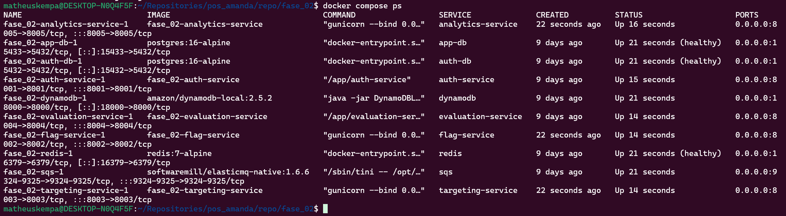

### Evidencia - Health checks locais

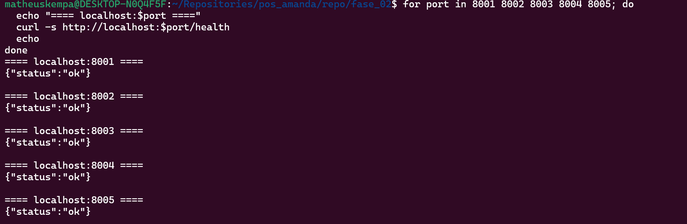

### Evidencias - Teste automatizado local

O script `scripts/comprovacao-e2e.sh` foi criado para validar automaticamente o ambiente local. Ele sobe o Docker Compose, verifica os health checks, cria uma flag, cria uma regra de targeting, chama o `evaluation-service`, confirma o consumo da mensagem pelo `analytics-service` e verifica o registro no DynamoDB Local.

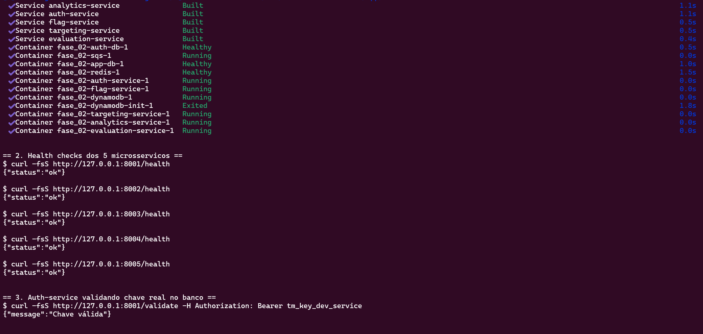

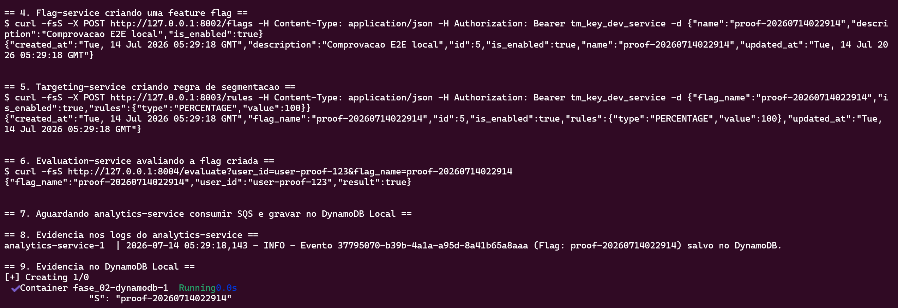

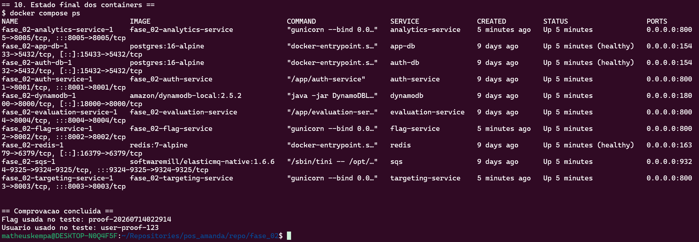

## 4. Conteinerizacao dos Microsservicos

Cada microsservico recebeu seu proprio Dockerfile. A estrategia foi manter as imagens focadas apenas na aplicacao e suas dependencias, sem embutir configuracoes fixas de ambiente. Assim, a mesma imagem pode ser usada localmente e na AWS, mudando apenas as variaveis de ambiente.

Exemplo:

```text
Ambiente local:
AWS_SQS_URL=http://sqs:9324/000000000000/togglemaster-events
AWS_SQS_ENDPOINT_URL=http://sqs:9324
AWS_DYNAMODB_ENDPOINT_URL=http://dynamodb:8000

Ambiente AWS:
AWS_SQS_URL=https://sqs.us-east-1.amazonaws.com/325662539204/togglemaster-events
Sem AWS_SQS_ENDPOINT_URL
Sem AWS_DYNAMODB_ENDPOINT_URL
```

Isso evita misturar ambiente local e ambiente cloud. O Docker Compose usa endpoints locais; o Kubernetes usa endpoints reais da AWS.

## 5. Provisionamento AWS

Para a opcao AWS Academy, todos os recursos foram criados manualmente pelo Console da AWS, conforme exigido pelo enunciado. A regiao utilizada foi `us-east-1`.

Recursos criados:

```text
EKS cluster: togglemaster-cluster
Node group: togglemaster-node-group
ECR repositories: 5 repositorios
RDS PostgreSQL: 3 instancias
ElastiCache Redis: 1 cluster
DynamoDB: 1 tabela
SQS: 1 fila standard
```

## 6. EKS e Node Group

O cluster Kubernetes foi criado usando o Amazon EKS pelo Console AWS, sem utilizar `eksctl create cluster`, seguindo a orientacao da opcao AWS Academy. O cluster foi criado com a role `LabRole`. Depois, foi criado um Managed Node Group tambem usando a `LabRole`, permitindo que os nodes herdassem permissoes da conta do laboratorio.

### Evidencia - Cluster EKS ativo

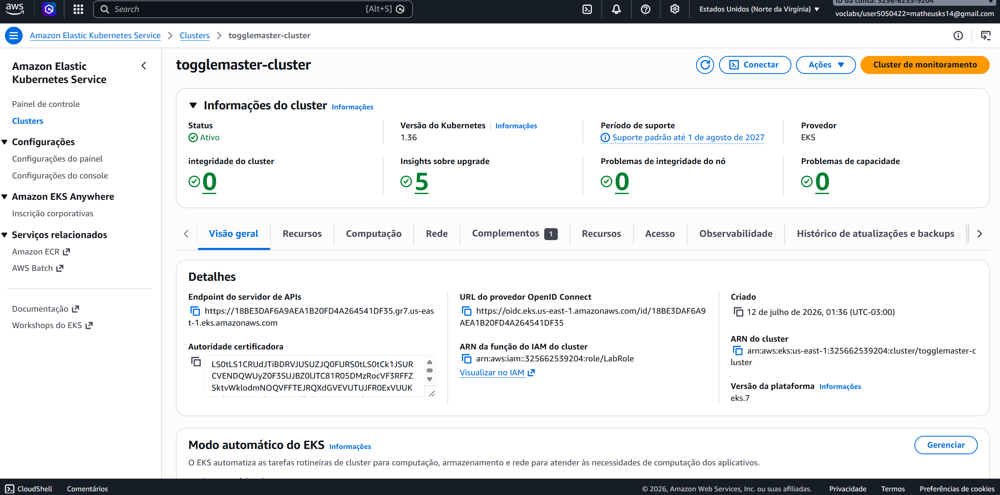

### Evidencia - Computacao do cluster

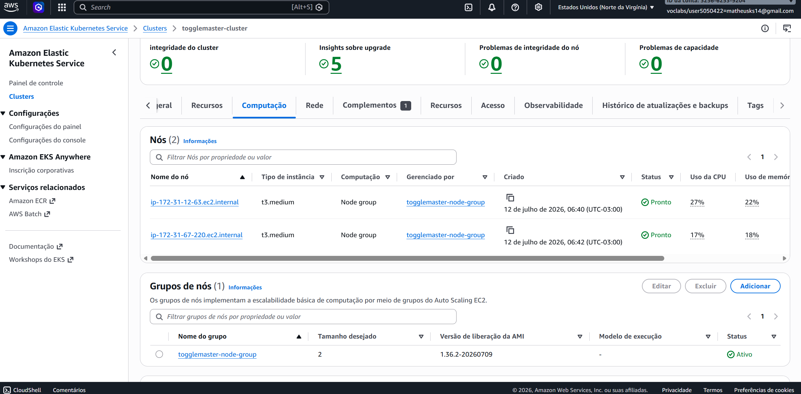

### Evidencia - Kubernetes no Console

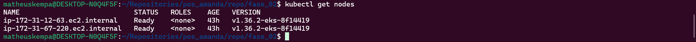

### Evidencia - Redes do cluster

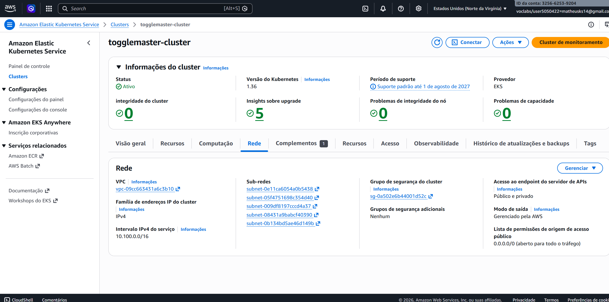

### Evidencia - Node Group ativo

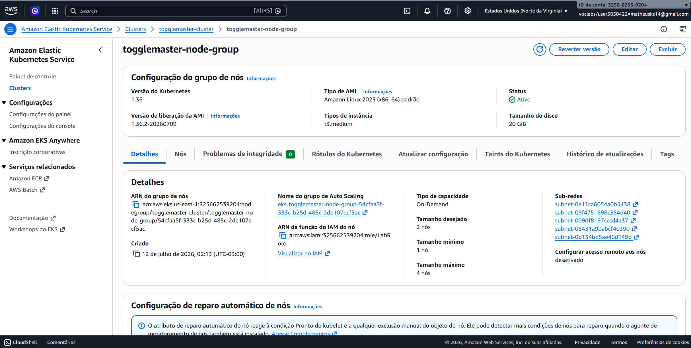

### Evidencia - Nodes e pods pelo terminal

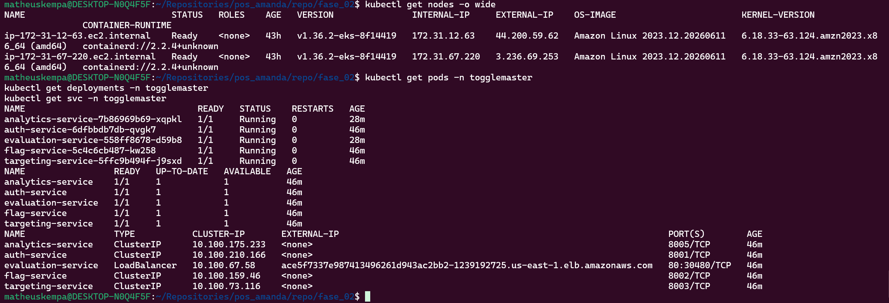

## 7. Repositorios ECR e Publicacao das Imagens

Foram criados cinco repositorios no Amazon ECR, um para cada microsservico:

```text
auth-service
flag-service
targeting-service
evaluation-service
analytics-service
```

As imagens foram buildadas localmente, tagueadas com a URI do ECR e publicadas com `docker push`.

Fluxo utilizado:

```bash
docker build -t auth-service ./auth-service
docker tag auth-service:latest 325662539204.dkr.ecr.us-east-1.amazonaws.com/auth-service:latest
docker push 325662539204.dkr.ecr.us-east-1.amazonaws.com/auth-service:latest
```

Esse mesmo processo foi repetido para os cinco servicos. A publicacao foi validada com `aws ecr describe-images`, confirmando a tag `latest`, o digest e o horario de publicacao.

### Evidencia - ECR

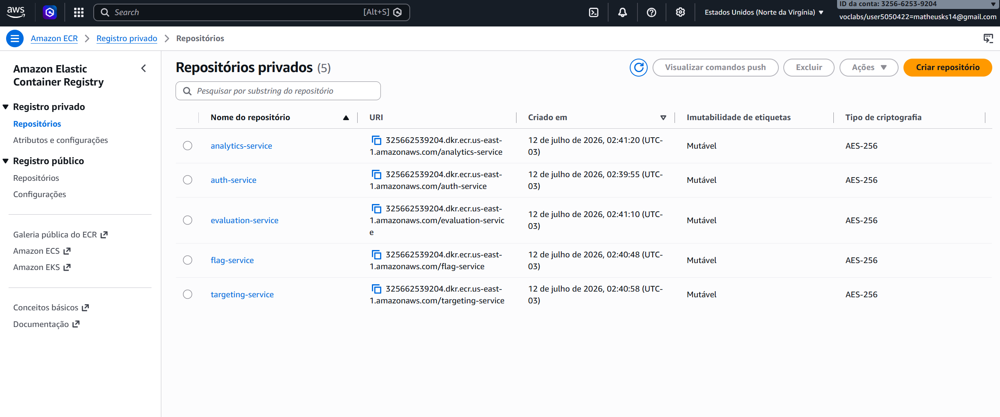

### Evidencia - Build e push das imagens

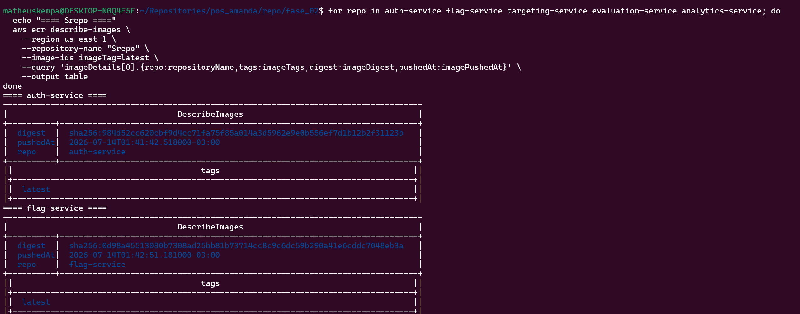

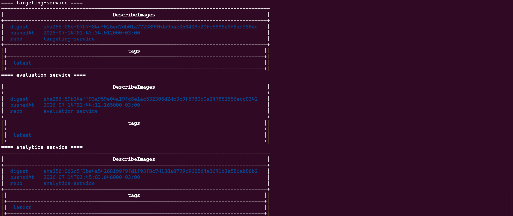

## 8. Bancos RDS PostgreSQL

O enunciado solicitava tres instancias independentes de RDS PostgreSQL. Foram criadas:

| RDS | Banco | Servico |
|---|---|---|
| `togglemaster-auth-db` | `auth_db` | `auth-service` |
| `togglemaster-flag-db` | `flags_db` | `flag-service` |
| `togglemaster-targeting-db` | `targeting_db` | `targeting-service` |

Os scripts SQL de cada servico foram executados nos bancos correspondentes:

```text
auth-service/db/init.sql
flag-service/db/init.sql
targeting-service/db/init.sql
```

Essa separacao garante independencia entre os dados de autenticacao, flags e regras de segmentacao.

### Evidencia - RDS PostgreSQL

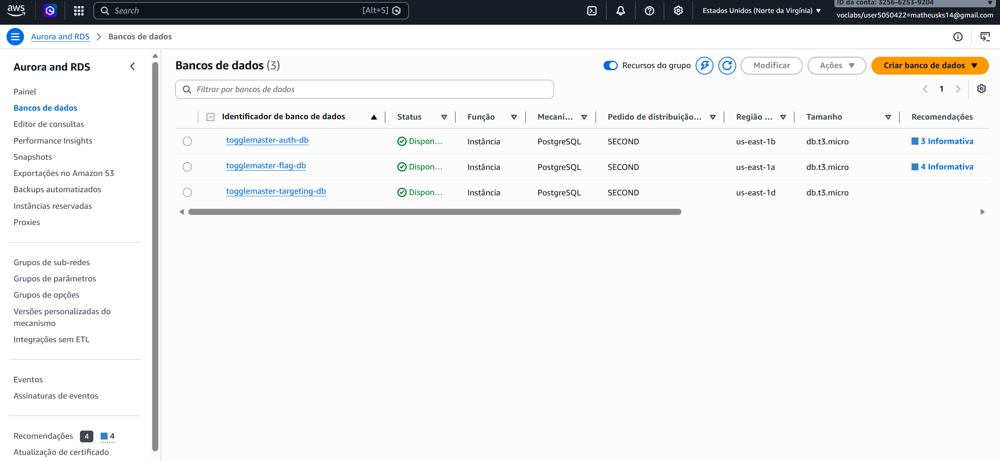

## 9. ElastiCache Redis

Foi criado um cluster ElastiCache Redis chamado `togglemaster-redis`, usando Redis OSS, porta `6379`, modo de cluster desabilitado e node type `cache.t4g.micro`. O Redis e utilizado pelo `evaluation-service` para cache das informacoes de flag e targeting.

Na primeira avaliacao de uma flag, o `evaluation-service` consulta os servicos internos e grava no Redis. Nas chamadas seguintes, o servico utiliza o cache, o que aparece nos logs como `Cache HIT`.

### Evidencia - ElastiCache Redis

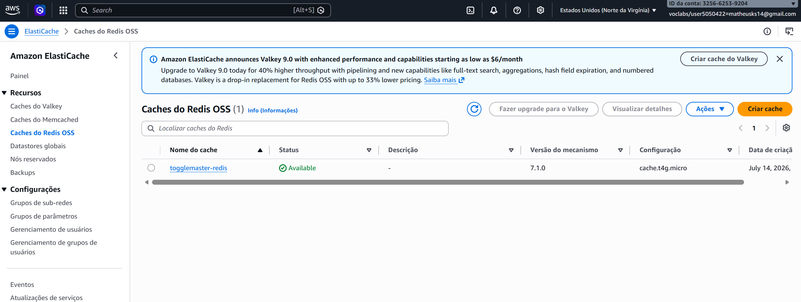

## 10. DynamoDB

Foi criada a tabela `ToggleMasterAnalytics` no DynamoDB, com chave de particao:

```text
event_id: String
```

Essa tabela recebe os eventos processados pelo `analytics-service`. Cada item contem:

```text
event_id
user_id
flag_name
result
timestamp
```

### Evidencia - DynamoDB

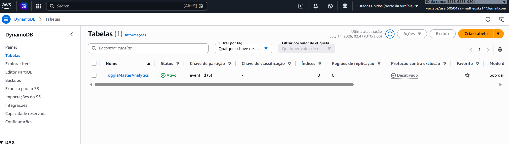

### Evidencia - Detalhes DynamoDB

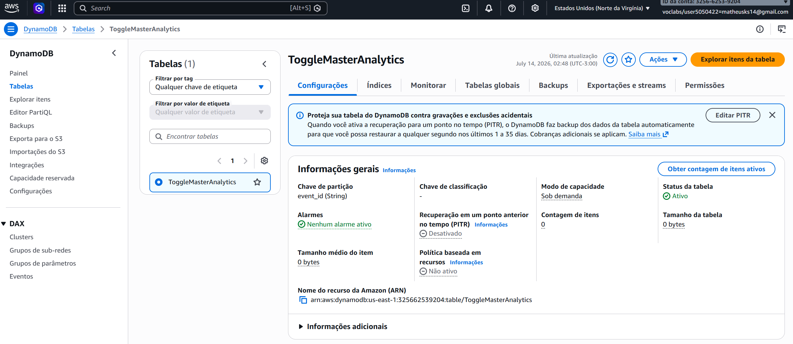

### Evidencia - Dados no DynamoDB apos os testes


## 11. SQS

Foi criada uma fila SQS Standard chamada `togglemaster-events`. Essa fila conecta o `evaluation-service` ao `analytics-service`.

O `evaluation-service` publica uma mensagem na fila sempre que uma flag e avaliada. O `analytics-service` fica executando um worker em background, lendo mensagens da fila, processando o payload e gravando o resultado no DynamoDB.

### Evidencia - SQS

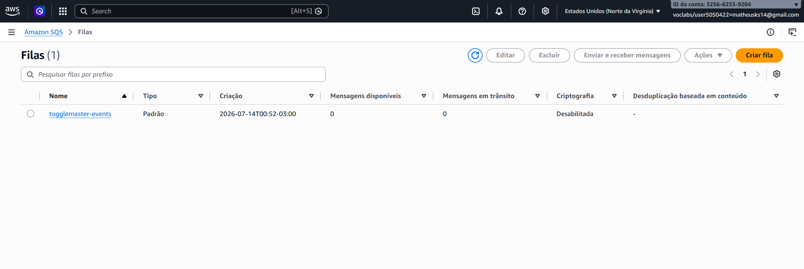

## 12. Manifests Kubernetes

Os manifests Kubernetes foram organizados na pasta `k8s/`. Eles definem namespace, configuracoes, secrets, deployments, services e HPAs.

Arquivos criados:

```text
k8s/namespace.yaml
k8s/configmap.yaml
k8s/secrets.example.yaml
k8s/secrets.yaml
k8s/auth-service.yaml
k8s/flag-service.yaml
k8s/targeting-service.yaml
k8s/evaluation-service.yaml
k8s/analytics-service.yaml
k8s/evaluation-hpa.yaml
k8s/analytics-hpa.yaml
k8s/kustomization.yaml
```

O arquivo `k8s/secrets.yaml` contem valores reais de senha e credenciais temporarias, por isso foi adicionado ao `.gitignore`. O arquivo seguro para versionamento e demonstracao e o `k8s/secrets.example.yaml`.

### Evidencia - Estrutura local dos manifests

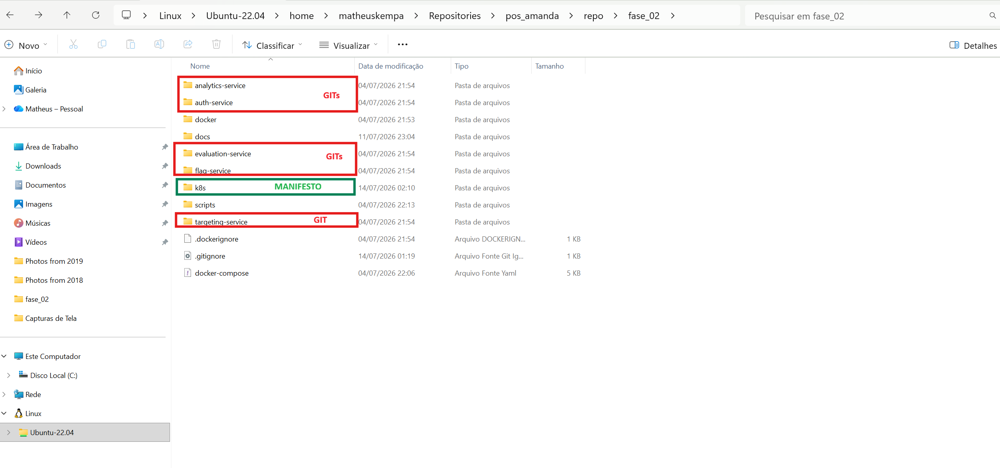

### Evidencia - Namespace e Kustomization

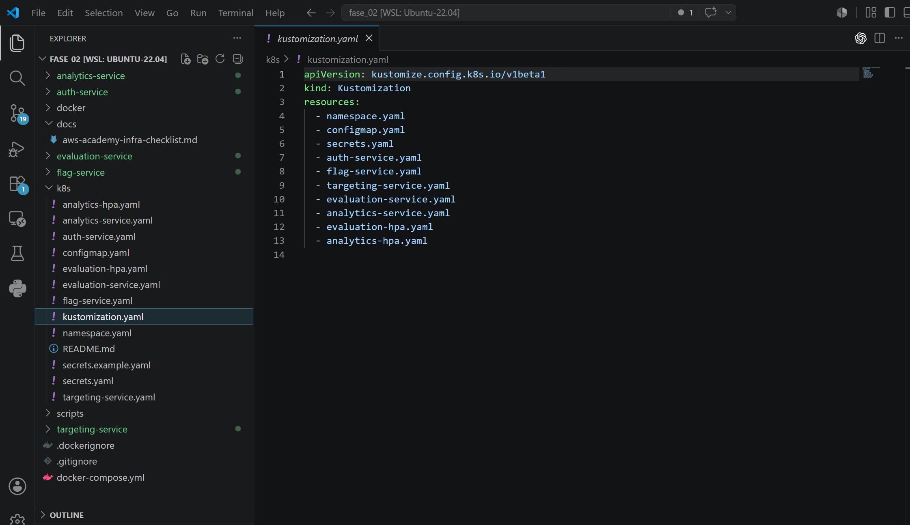

### Evidencia - ConfigMap

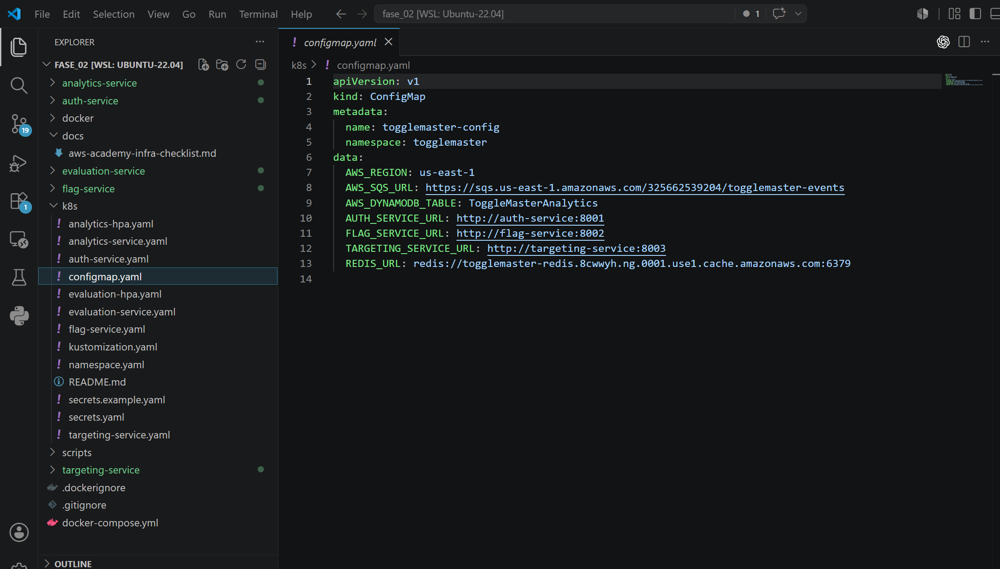

### Evidencia - Secrets Example

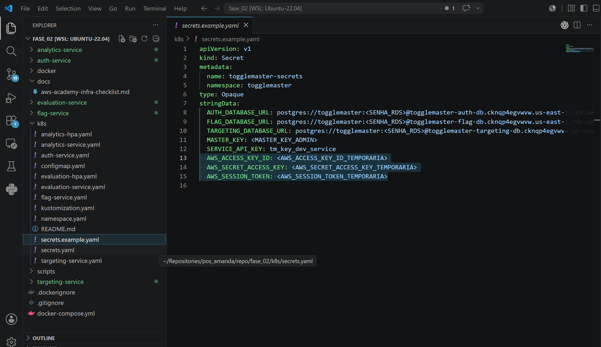

### Evidencia - Auth Service

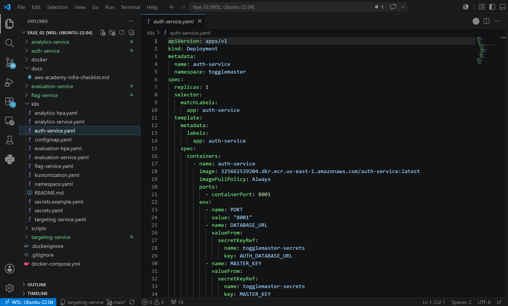

### Evidencia - Flag Service

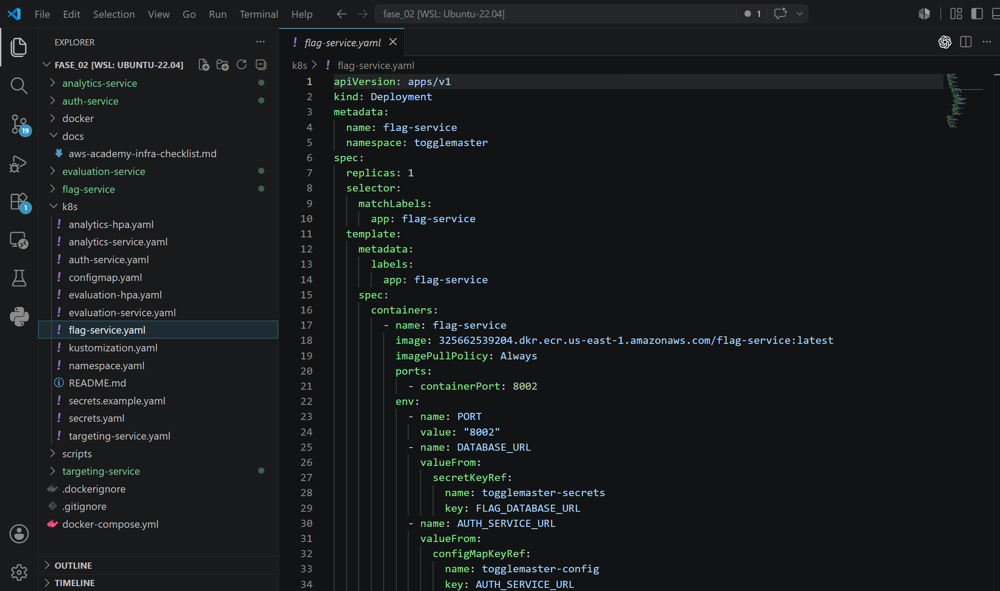

### Evidencia - Targeting Service

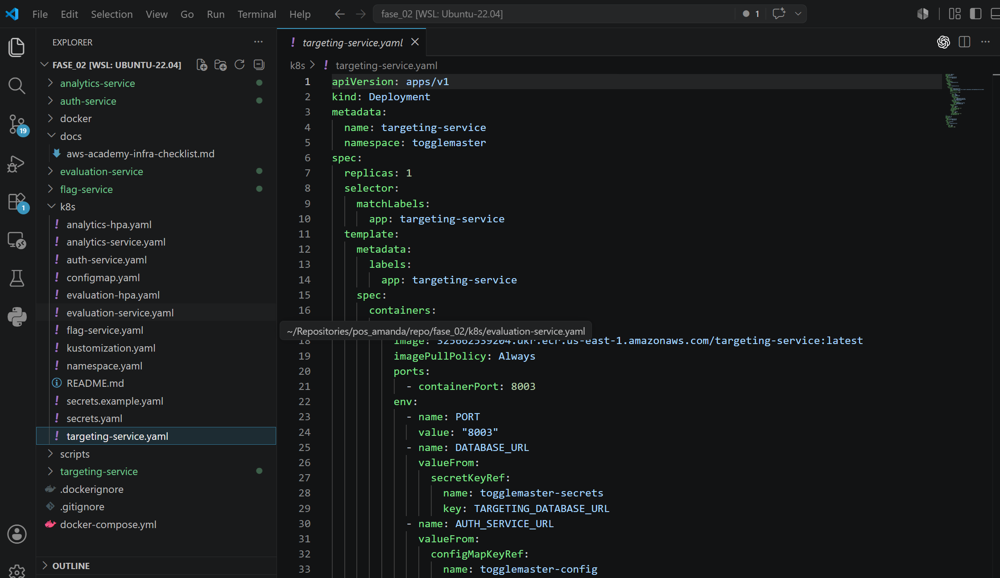

### Evidencia - Evaluation Service

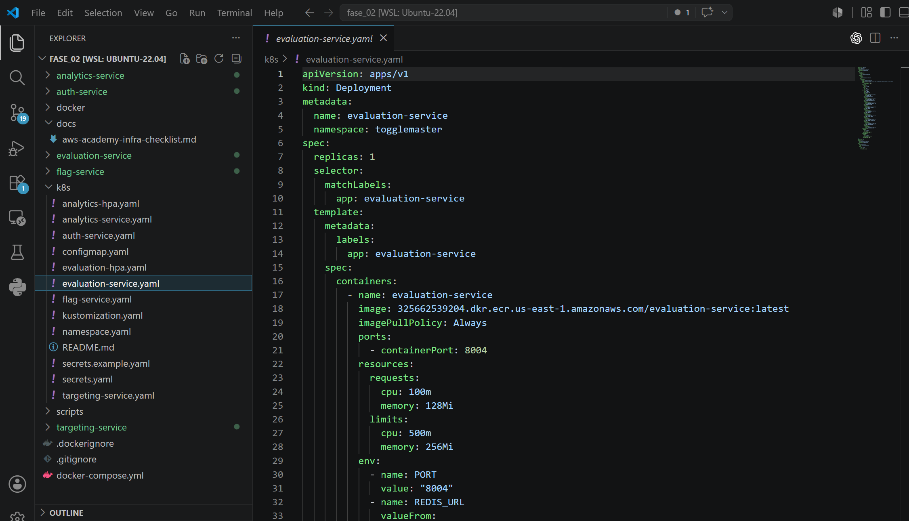

### Evidencia - Analytics Service

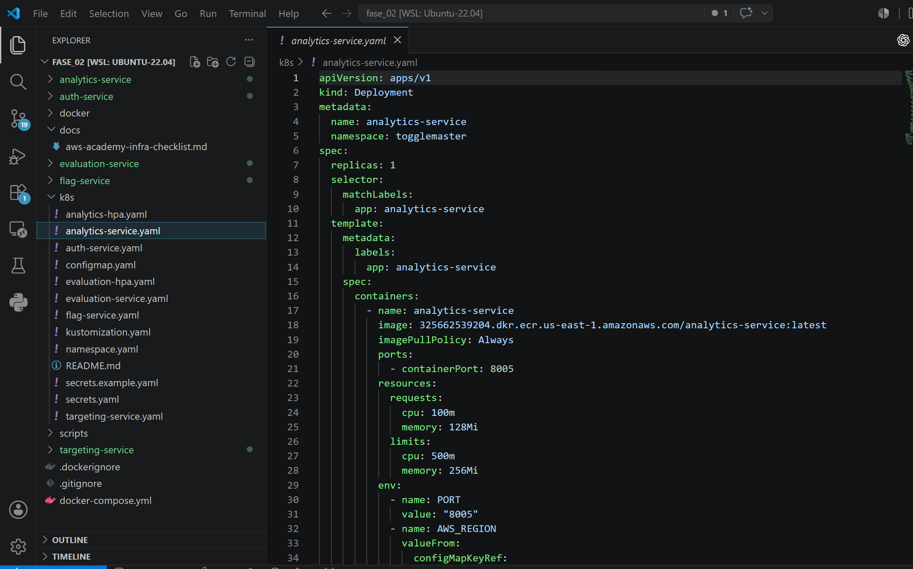

## 13. Deploy no Kubernetes

O deploy foi realizado com:

```bash
kubectl apply -k k8s
```

Depois da aplicacao dos manifests, os cinco microsservicos ficaram em execucao no namespace `togglemaster`.

### Evidencia - Apply dos manifests

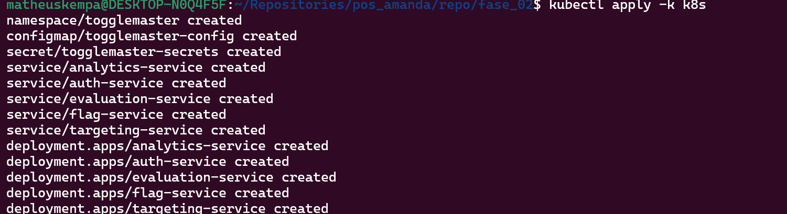

### Evidencia - Pods e Services

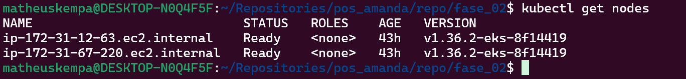

O `evaluation-service` foi exposto com um Service do tipo `LoadBalancer`, criando uma URL publica na AWS. Os demais servicos foram mantidos como `ClusterIP`, acessiveis apenas internamente dentro do cluster.

## 14. Observacao Sobre Nginx Ingress

O enunciado menciona demonstrar uma URL de Load Balancer criada para acesso externo. Nesta implementacao, o ponto de entrada externo foi implementado diretamente com um Service Kubernetes do tipo `LoadBalancer` para o `evaluation-service`. Essa abordagem cria um Load Balancer AWS e permite chamadas externas ao endpoint publico do servico.

Nao foi implantado um Nginx Ingress Controller dedicado nesta etapa. Caso seja exigido estritamente o uso de Nginx Ingress, a evolucao natural seria instalar o `ingress-nginx`, criar um recurso `Ingress` apontando para o `evaluation-service` e demonstrar a chamada pelo Load Balancer do controller. Para a demonstracao atual, o acesso externo foi comprovado pelo LoadBalancer do proprio Service Kubernetes.

## 15. Horizontal Pod Autoscaler

Foram criados dois HPAs, conforme requisito:

```text
evaluation-service-hpa
analytics-service-hpa
```

Ambos foram configurados com:

```text
minReplicas: 1
maxReplicas: 4
averageUtilization: 70
```

Tambem foram adicionados `resources.requests` de CPU nos deployments, pois o HPA precisa desses valores para calcular a porcentagem de uso.

### Evidencia - HPA Evaluation Service

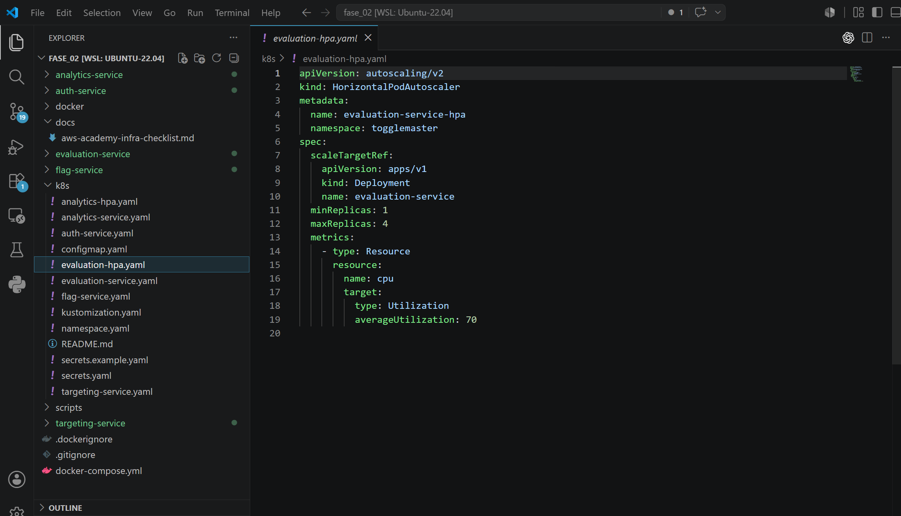

### Evidencia - HPA Analytics Service

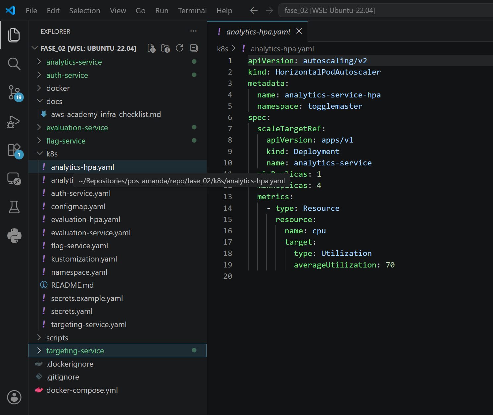

### Evidencia - HPA em execucao

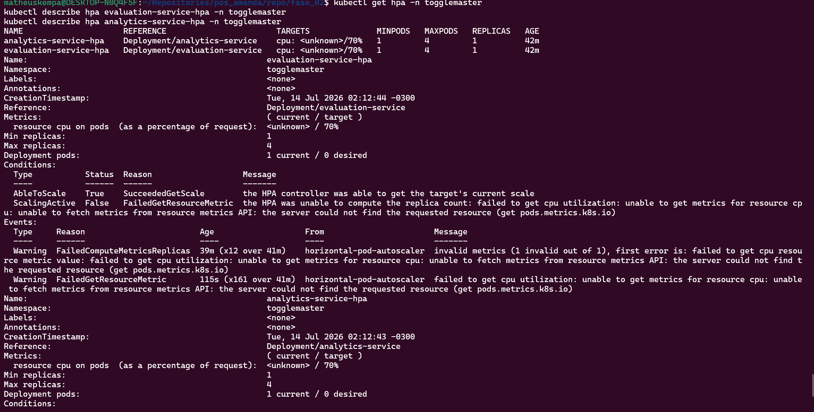

Durante a validacao, o metrics-server foi configurado e o HPA passou a exibir valores reais de CPU. No teste automatizado de carga, o `evaluation-service` escalou para 2 replicas e o `analytics-service` escalou para 4 replicas.

## 16. Teste E2E em Nuvem

Foi criado o script:

```text
scripts/comprovacao-aws-e2e-hpa.sh
```

Esse script automatiza a comprovacao na AWS. Ele executa as seguintes etapas:

1. Verifica a autenticacao AWS.
2. Lista nodes, pods, services e HPAs.
3. Descobre o LoadBalancer do `evaluation-service`.
4. Testa o health publico.
5. Testa os servicos internos com um pod temporario de curl.
6. Cria uma flag no `flag-service`.
7. Cria uma regra no `targeting-service`.
8. Chama o `evaluation-service` pelo LoadBalancer.
9. Gera carga no `evaluation-service`.
10. Acompanha o HPA e os pods durante a carga.
11. Envia mensagens manualmente para a SQS.
12. Acompanha o consumo da fila pelo `analytics-service`.
13. Consulta o DynamoDB para comprovar a persistencia dos eventos.

### Evidencia - Teste E2E

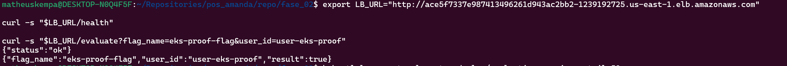

### Evidencia - Logs do teste E2E

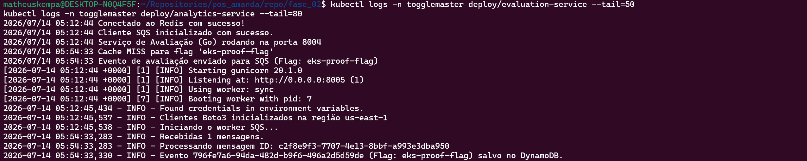

O teste comprovou dois grupos de dados no DynamoDB:

```text
Eventos gerados por chamadas reais ao evaluation-service
Eventos gerados por mensagens enviadas manualmente para a SQS
```

No teste executado, foram validados:

```text
1001 eventos gerados pelo fluxo do evaluation-service
200 eventos gerados por mensagens manuais na SQS
```

## 17. Interpretacao da Fila SQS com 0 Mensagens

Durante a execucao do teste, os atributos da SQS mostraram:

```text
ApproximateNumberOfMessages = 0
ApproximateNumberOfMessagesNotVisible = 0
```

Isso nao indica falha. Pelo contrario, indica que o `analytics-service` consumiu as mensagens rapidamente. Como o HPA aumentou o numero de pods do `analytics-service`, a fila foi drenada antes da consulta de atributos mostrar mensagens acumuladas.

A comprovacao de uso da fila aparece em tres lugares:

```text
Logs do analytics-service mostrando mensagens recebidas
Logs do analytics-service mostrando eventos salvos no DynamoDB
Consulta ao DynamoDB mostrando os 200 registros das mensagens manuais
```

## 18. Escalabilidade do Analytics Service

O enunciado permitia HPA por CPU como workaround para o AWS Academy. A estrategia adotada foi:

```text
Quando ha muitas mensagens na SQS, o analytics-service processa mais eventos.
Esse processamento aumenta o uso de CPU.
O HPA observa a CPU media dos pods.
Quando a CPU sobe, o HPA aumenta a quantidade de replicas.
```

Essa abordagem foi escolhida porque o AWS Academy possui restricoes de IAM e integracoes mais avancadas, o que tornaria o uso de KEDA por metrica de fila mais trabalhoso. O HPA por CPU e uma solucao mais simples, compativel com o ambiente do laboratorio e suficiente para demonstrar escalabilidade horizontal.

No teste, o `analytics-service` escalou para 4 pods, processou as mensagens da SQS e gravou os dados no DynamoDB.

## 19. Diferenca Entre os Data Stores

O projeto usa tres tipos de armazenamento, cada um com um proposito diferente:

### RDS PostgreSQL

O RDS foi usado para dados relacionais e operacionais dos microsservicos principais. Cada servico possui seu proprio banco:

```text
auth-service: api keys
flag-service: feature flags
targeting-service: regras de segmentacao
```

PostgreSQL foi escolhido porque esses dados possuem estrutura relacional, constraints, identificadores e necessidade de consistencia.

### ElastiCache Redis

O Redis foi usado como cache no `evaluation-service`. Ele evita chamadas repetidas ao `flag-service` e ao `targeting-service` para flags ja avaliadas recentemente. Isso melhora a latencia e reduz carga sobre os demais servicos.

### DynamoDB

O DynamoDB foi usado para dados analiticos gerados por eventos de avaliacao. Esses eventos sao independentes, possuem chave unica (`event_id`) e podem crescer em volume. DynamoDB e adequado para esse tipo de dado porque oferece baixa latencia, escalabilidade e modelo NoSQL flexivel.

## 20. Desafios Encontrados

Durante a implementacao, alguns desafios importantes apareceram:

1. **Credenciais do AWS Academy**: as credenciais sao temporarias e precisam ser renovadas. Em alguns momentos houve erro de permissao ou credenciais ausentes.
2. **LabRole**: no AWS Academy, a `LabRole` foi usada no cluster e no node group, conforme exigido. Algumas permissoes sao limitadas pelo ambiente do laboratorio.
3. **Acesso ao EKS via kubectl**: inicialmente houve erro de permissao, mas depois o kubeconfig foi atualizado corretamente.
4. **Credenciais AWS dentro dos pods**: para permitir acesso a SQS e DynamoDB no ambiente Academy, as credenciais temporarias foram passadas via `Secret` do Kubernetes.
5. **Metrics Server**: inicialmente o HPA aparecia como `<unknown>`. Apos configurar metrics-server, o HPA passou a exibir metricas reais de CPU.
6. **Nginx Ingress**: a exposicao externa foi feita via Service `LoadBalancer`, nao via Nginx Ingress Controller dedicado.

## 21. Scripts Criados

### Script local

```text
scripts/comprovacao-e2e.sh
```

Valida o ambiente Docker Compose local.

### Script AWS

```text
scripts/comprovacao-aws-e2e-hpa.sh
```

Valida o ambiente EKS/AWS, incluindo LoadBalancer, HPA, SQS e DynamoDB.

## 22. Comandos Principais de Evidencia

### Local

```bash
docker compose up -d --build
docker compose ps
./scripts/comprovacao-e2e.sh
```

### AWS / Kubernetes

```bash
kubectl get nodes -o wide
kubectl get pods -n togglemaster -o wide
kubectl get svc -n togglemaster
kubectl get hpa -n togglemaster
./scripts/comprovacao-aws-e2e-hpa.sh
```

### DynamoDB

```bash
aws dynamodb scan \
  --region us-east-1 \
  --table-name ToggleMasterAnalytics \
  --output table
```

## 23. Conclusao

Ao final da fase, o projeto ficou conteinerizado, executavel localmente com Docker Compose e implantado em Kubernetes na AWS. As cinco imagens dos microsservicos foram publicadas no ECR e executadas como pods no EKS. Os recursos gerenciados da AWS foram provisionados e integrados com sucesso: RDS para dados relacionais, ElastiCache para cache, SQS para mensageria e DynamoDB para analiticos.

Tambem foi demonstrada escalabilidade horizontal com HPA em dois servicos principais: `evaluation-service` e `analytics-service`. O teste automatizado comprovou o fluxo completo, desde a chamada externa ao LoadBalancer ate a gravacao dos eventos no DynamoDB, incluindo carga, fila SQS, processamento assíncrono e escalabilidade dos pods.

Com isso, os principais requisitos da Fase 2 foram atendidos: conteinerizacao, execucao local, provisionamento em nuvem, publicacao das imagens, deploy Kubernetes, integracao com servicos AWS, comprovacao E2E e demonstracao de escalabilidade.
